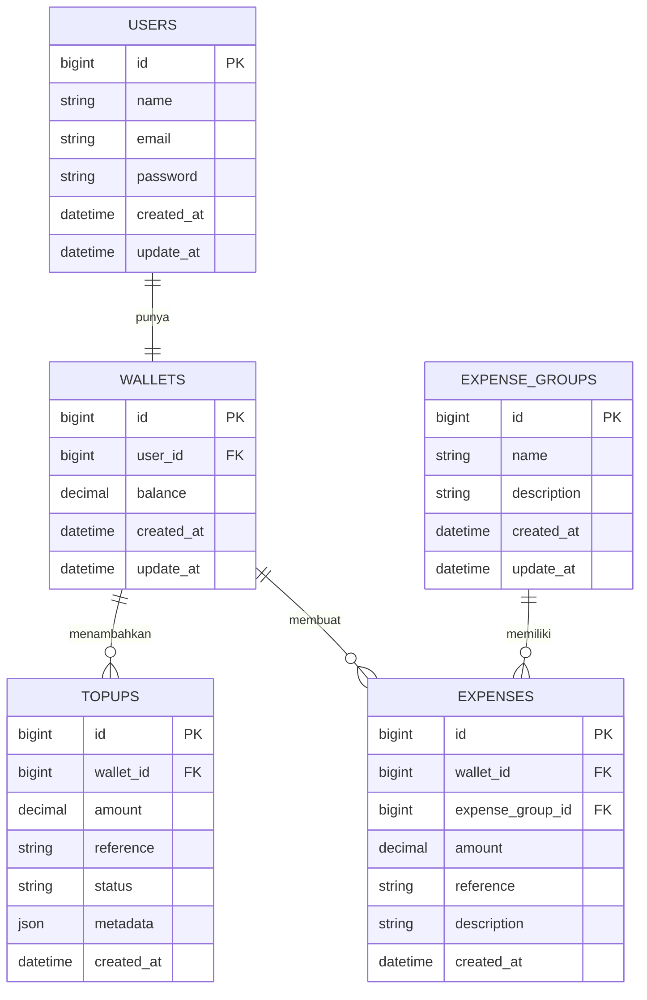

```mermaid
erDiagram
    USERS ||--|| WALLETS : punya
    WALLETS ||--o{ TOPUPS : menambahkan
    WALLETS ||--o{ EXPENSES : membuat
    EXPENSE_GROUPS ||--O{EXPENSES: memiliki
    USERS {
        bigint id PK
        string name
        string email
        string password
        datetime created_at
        datetime update_at
    }
    WALLETS {
        bigint id PK
        bigint user_id FK
        decimal balance
        datetime created_at
        datetime update_at
    }
    EXPENSES {
        bigint id PK
        bigint wallet_id FK
        bigint expense_group_id FK
        decimal amount
        string reference
        string description
        datetime created_at
    }
    TOPUPS {
        bigint id PK
        bigint wallet_id FK
        decimal amount
        string reference
        string status
        json metadata
        datetime created_at
    }
    EXPENSE_GROUPS{
        bigint id PK
        string name
        string description
        datetime created_at
        datetime update_at
    }
```
